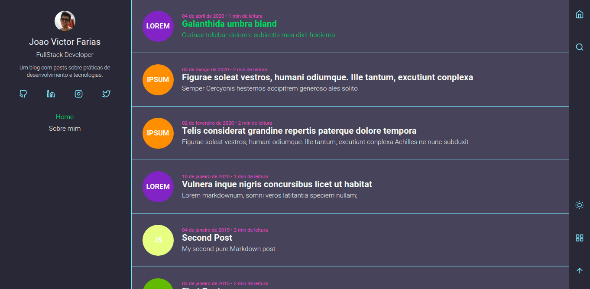

<!-- AUTO-GENERATED-CONTENT:START (STARTER) -->

<div align="center" style="margin-bottom: 20px;">

</div>

<div align="center" style="margin: 20px;">

[](http://github.com/jvictorfarias/my-blog/LICENSE.md)

[](https://www.codacy.com/manual/jvictorfarias/my-blog?utm_source=github.com&utm_medium=referral&utm_content=jvictorfarias/my-blog&utm_campaign=Badge_Grade)


<p align="center" >
  <a href="#fire-prévia-da-aplicação"> :fire: Prévia da Aplicação</a> |
  <a href="#rocket-tecnologias-usadas"> :rocket: Tecnologias Usadas</a> |
  <a href="#hammer-deploy-da-aplicação"> :hammer: Deploy da Aplicação</a> |
  <a href="#thinking-como-contribuir?"> :thinking: Como Contribuir?</a> |
  <a href="#zap-executando-o-projeto"> :zap: Executando o Projeto </a> 
</p>

</div>

## 🚀 O projeto

---

Meu blog pessoal com informações sobre mim, posts sobre tecnologia e programação, além de
projetos desenvolvidos por mim(Em construção)

## :fire: Prévia da Aplicação

---

<div align="center"> 

</div>

### :rocket: Tecnologias Usadas

---

O projeto foi feito com as seguintes tecnologias:

- [GatsbyJS](https://www.gatsbyjs.org/)
- [ReactJS](https://pt-br.reactjs.org/)
- [GraphQL](https://graphql.org/)
- [Styled-Components](https://styled-components.com/)
  {...}

## :hammer: Deploy da Aplicação

---

- [Netlify](http://jvictorfarias.netlify.app/)

## 🧐 Como Contribuir?

---

**Faça um fork deste repositório**

```bash
# Clone o seu fork
$ git clone url-do-seu-fork && cd my-blog

# Crie uma branch com sua feature ou correção de bugs
$ git checkout -b minha-branch

# Faça o commit das suas alterações
$ git commit -m 'feature/bugfix: minhas alterações'

# Faça o push para a sua branch
$ git push origin minha-branch
```

Depois que o merge da sua pull request for feito, você pode deletar a sua branch.

## :zap: Executando o Projeto

---

#### Clonando o projeto

```sh
$ git clone https://github.com/jvictorfarias/my-blog.git
$ cd my-blog
```

#### Iniciando o projeto

---

```sh
$ cd web
$ yarn && yarn develop
```

### :memo: Licença

---

Este projeto é desenvolvido sob a licença MIT. Veja o arquivo [LICENSE](LICENSE.md) para saber mais detalhes.

<p align="center" style="margin-top: 20px; border-top: 1px solid #eee; padding-top: 20px;">Feito com :purple_heart: by <strong> Joao Victor Farias</strong> </p>
